A simple React component to embed Live2D models (via `live2d-widget`) in Next.js projects.

[](https://www.npmjs.com/package/next-live2d)
[](LICENSE)
[](https://github.com/2hjaito/next-live2d)
[](https://www.npmjs.com/package/next-live2d)


## 📢 Latest Update

### v2.0.2 - GitHub Username Migration

- Updated default `baseUrl` host from the old GitHub username to `2hjaito`.
- Updated repository links and badges to the new GitHub profile.
- Kept full compatibility for existing model paths ending with `/model.json`.

Full history:

- English: [CHANGELOG.md](./CHANGELOG.md)
- Vietnamese: [CHANGELOG-vi.md](./CHANGELOG-vi.md)

## ✨ Features

- 🧠 Auto-load [Live2D Widget](https://github.com/xiazeyu/live2d-widget.js)
- ⚙️ Zero-config usage with App Router
- 🎒 Comes with 35+ built-in models
- ✅ SSR-safe using `dynamic(() => import(...), { ssr: false })`
- 🎲 Random model selection
- 🎨 Full customization (position, size, opacity, etc.)
- 📦 Custom base URL support (self-host models)
- 🔄 Loading state & error handling
- 💪 TypeScript support with exported types
- ⚡ React 18 & 19 compatible

---

## 🚀 Installation

```bash
npm install next-live2d
```


🧩 Usage in Next.js (app/layout.tsx)
```tsx
'use client'

import { Live2DWidget } from 'next-live2d'

import { ReactNode } from 'react'
import './globals.css'

export default function RootLayout({ children }: { children: ReactNode }) {
  return (
    <html lang="en">
      <body>
        <main>{children}</main>
        <Live2DWidget modelName="mai" />
      </body>
    </html>
  )
}
```

## 🔧 Advanced Usage

## 🛡️ Next.js Stability Guide

To minimize runtime issues in production projects:

1. Render `Live2DWidget` only in Client Components.
2. Avoid rendering the widget from Server Components directly.
3. Keep one widget instance per page/layout to avoid competing initializations.
4. Prefer stable `modelName` values across frequent rerenders.
5. For custom model hosting, ensure `model.json` and textures are accessible with correct CORS headers.

Recommended pattern for App Router:

```tsx
'use client'

import { Live2DWidget } from 'next-live2d'

export default function Live2DClientWidget() {
  return <Live2DWidget modelName="histoire" />
}
```

### Basic Customization

```tsx
<Live2DWidget
  modelName="senko"
  position="left"
  width={200}
  height={350}
  opacity={0.9}
  hoverOpacity={0.3}
/>
```

### Random Model

```tsx
<Live2DWidget random />
```

### Custom Base URL (Self-host models)

```tsx
<Live2DWidget
  modelName="my-model"
  baseUrl="https://my-cdn.com/live2d-models"
/>
```

### With Loading State & Callbacks

```tsx
<Live2DWidget
  modelName="histoire"
  fallback={<div>Loading Live2D...</div>}
  onLoad={() => console.log('Model loaded!')}
  onError={(err) => console.error('Failed:', err)}
  onClick={() => alert('You clicked the model!')}
/>
```

### Tailwind CSS

```tsx
<Live2DWidget
  modelName="senko"
  className="bottom-0 right-0 fixed z-50 opacity-80"
  style={{ width: 200, height: 300 }}
/>
```

## 📋 Props Reference

| Prop | Type | Default | Description |
|------|------|---------|-------------|
| `modelName` | `string` | `'histoire'` | Name of the model folder (must include `model.json`) |
| `baseUrl` | `string` | GitHub raw URL | Custom base URL to load models from |
| `position` | `'left' \| 'right'` | `'right'` | Widget position on screen |
| `width` | `number` | `180` | Widget width in pixels |
| `height` | `number` | `300` | Widget height in pixels |
| `opacity` | `number` | `0.8` | Default opacity (0-1) |
| `hoverOpacity` | `number` | `0.2` | Opacity when hovering (0-1) |
| `showOnMobile` | `boolean` | `true` | Show widget on mobile devices |
| `random` | `boolean` | `false` | Pick a random built-in model |
| `className` | `string` | - | Custom CSS/Tailwind classes |
| `style` | `CSSProperties` | - | Inline styles |
| `fallback` | `ReactNode` | - | Component to show while loading |
| `onLoad` | `() => void` | - | Callback when model loads |
| `onError` | `(error) => void` | - | Callback on load error |
| `onClick` | `() => void` | - | Callback when widget is clicked |

## 🧭 Versioning

- This project follows semantic versioning.
- Patch releases focus on stability and compatibility fixes.
- Minor releases add non-breaking features.
- Major releases may include behavior changes or migration notes.

## 🔤 TypeScript Support

```tsx
import { 
  Live2DWidget,
  Live2DWidgetProps,
  ModelName,
  BUILT_IN_MODELS,
  getRandomModel 
} from 'next-live2d';

// Get a random model name
const model: ModelName = getRandomModel();

// Access all built-in model names
console.log(BUILT_IN_MODELS); // ['histoire', 'bilibili-22', ...]
```

## 🧠 Tips

The Live2D widget is rendered into a #live2d-widget DOM element, positioned as fixed by default.

If you pass className or style, they will override the default style.

## 📁 Model Path
By default, the widget looks for:

### 📦 Available Built-in Models

| Model Name           | Preview (coming soon)         | Usage                                |
|----------------------|-------------------------------|--------------------------------------|
| histoire             | 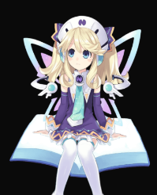    | `<Live2DWidget modelName="histoire" />`             |
| bilibili-22          | 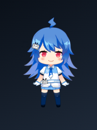     | `<Live2DWidget modelName="bilibili-22" />`          |
| bilibili-33          | 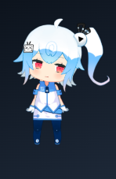    | `<Live2DWidget modelName="bilibili-33" />`          |
| cat-black            | 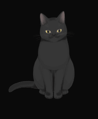    | `<Live2DWidget modelName="cat-black" />`            |
| cat-white            | 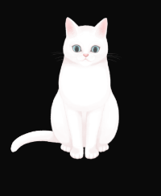   | `<Live2DWidget modelName="cat-white" />`            |
| chino                |    | `<Live2DWidget modelName="chino" />`                |
| date                 | 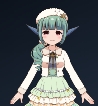      | `<Live2DWidget modelName="date" />`                 |
| hallo                | 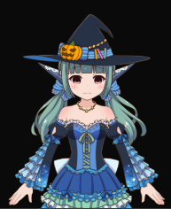       | `<Live2DWidget modelName="hallo" />`                |
| haruto               |         | `<Live2DWidget modelName="haruto" />`               |
| hibiki               | 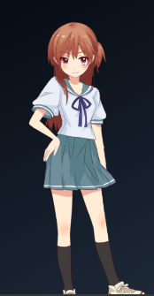     | `<Live2DWidget modelName="hibiki" />`               |
| HK416-1-normal       | 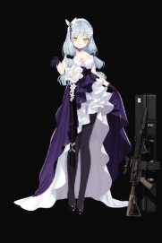      | `<Live2DWidget modelName="HK416-1-normal" />`       |
| HK416-2-destroy      | 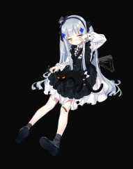   | `<Live2DWidget modelName="HK416-2-destroy" />`      |
| HK416-2-normal       | 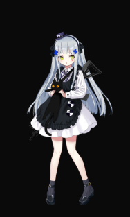     | `<Live2DWidget modelName="HK416-2-normal" />`       |
| Kar98k-normal        | 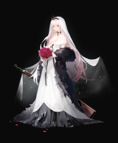  | `<Live2DWidget modelName="Kar98k-normal" />`        |
| kobayaxi             | 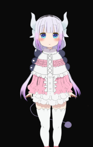  | `<Live2DWidget modelName="kobayaxi" />`             |
| koharu               |      | `<Live2DWidget modelName="koharu" />`               |
| kp31                 | 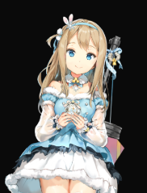     | `<Live2DWidget modelName="kp31" />`                 |
| live_uu              |   | `<Live2DWidget modelName="live_uu" />`              |
| mai                  |     | `<Live2DWidget modelName="mai" />`                  |
| murakumo             | 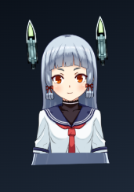   | `<Live2DWidget modelName="murakumo" />`             |
| Pio                  | 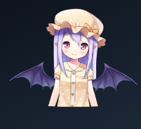    | `<Live2DWidget modelName="Pio" />`                  |
| platelet             | 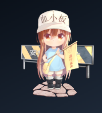   | `<Live2DWidget modelName="platelet" />`             |
| platelet_2           | 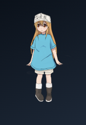    | `<Live2DWidget modelName="platelet_2" />`           |
| potion-Maker-Pio     | 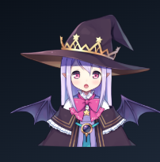  | `<Live2DWidget modelName="potion-Maker-Pio" />`     |
| rem                  | 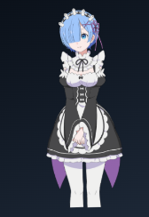    | `<Live2DWidget modelName="rem" />`                  |
| rem_2                | 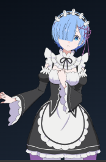       | `<Live2DWidget modelName="rem_2" />`                |
| shizuku              |       | `<Live2DWidget modelName="shizuku" />`              |
| shizuku_48           | 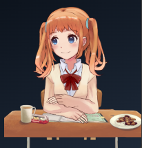     | `<Live2DWidget modelName="shizuku_48" />`           |
| shizuku_pajama       | 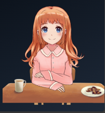     | `<Live2DWidget modelName="shizuku_pajama" />`       |
| terisa               | 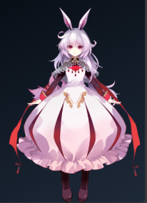      | `<Live2DWidget modelName="terisa" />`               |
| tia                  | 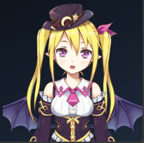     | `<Live2DWidget modelName="tia" />`                  |
| umaru                |     | `<Live2DWidget modelName="umaru" />`                |
| uni                  | 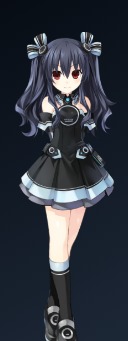       | `<Live2DWidget modelName="uni" />`                  |
| wed_16               | 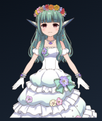     | `<Live2DWidget modelName="wed_16" />`               |
| xisitina             |       | `<Live2DWidget modelName="xisitina" />`             |
| z16                  | 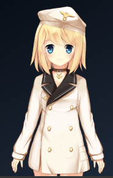       | `<Live2DWidget modelName="z16" />`                  |
| Senko_Normals        |     | `<Live2DWidget modelName="Senko_Normals" />`        |


## 🧑‍💻 Author
Trần Hữu Đang
Website: [https://dangth.dev](https://dangth.dev)

📝 License
[MIT]()
